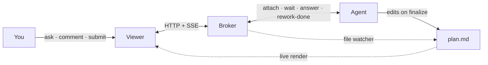

# Plan Review

A lean tool for reviewing agent-generated markdown plans interactively: read them formatted in a desktop viewer, select lines to **ask questions** (answered from the agent's live context) or **leave feedback** (anchored, queued, never triggering an immediate regeneration), and **submit a review** as one batch that the agent reworks.

## Prerequisites

These are the things you must install **yourself** — `bun install` cannot set them up for you. Everything else (the JavaScript dependencies, the Claude Code symlinks, the broker daemon, and the viewer build) is installed for you by [Setup](#setup).

| Prerequisite | Why | Needed for | Install |
| --- | --- | --- | --- |
| **macOS** | The daemon is a launchd **LaunchAgent** and the viewer is a **Tauri `.app`**. | Everything — the tool only runs on macOS. On other platforms `bun install` succeeds, but the daemon/viewer steps no-op. | — (OS) |
| **Bun ≥ 1.2.0** | The **runtime** for the daemon + CLI (`bun:sqlite`, `Bun.serve`), not just the package manager — so it can't bootstrap itself (you need it to run `bun install` at all). | Everything | `brew install bun` |
| **Claude Code** | The agent surface; it discovers the skill + CLI wrapper via symlinks in its config dir (`~/.claude`, or `$CLAUDE_CONFIG_DIR`). | Everything | — |
| **Rust toolchain** (`cargo`, `rustc`) | Compiles the Tauri viewer (setup runs the build, but won't install Rust). Without it, install still succeeds and the viewer builds lazily on first `open` once Rust is present. | Viewer only | `brew install rust` (or `curl --proto '=https' --tlsv1.2 -sSf https://sh.rustup.rs \| sh`) |
| **Xcode Command Line Tools** | Rust won't link without them. | Viewer only | `xcode-select --install` (Apple's installer — no Homebrew formula) |

`preinstall` re-checks these and **warns** (with the exact commands above) if Rust or the Command Line Tools are missing — but it **never fails the install**.

## Setup

`bun install` is the entire setup — it runs `preinstall` (prerequisite checks) and `postinstall` (`plan-review setup`) lifecycle hooks that wire everything in one command.

### Step by step

```sh
# 1. Install Bun first if you don't have it (it can't install itself):
brew install bun

# 2. Clone and enter the repo:
git clone <repo-url> planning-tool
cd planning-tool

# 3. One command does everything:
bun install
```

What you'll see: `preinstall` prints a prerequisites check, then `postinstall` runs `plan-review setup` (symlinks → daemon → viewer). On a fresh clone with Rust present the first run compiles the viewer, which can take a few minutes; subsequent runs skip it.

Then verify:

```sh
bun run packages/cli/src/index.ts status
# => {"installed": true, "running": true, "health": { "ok": true, ... }}
```

Once this is green, the next time Claude generates a markdown plan it auto-discovers the skill and opens it for review — nothing else to start.

**Re-running.** `bun install` is idempotent and is also how you redo setup (e.g. after moving the repo — symlinks are absolute). It never restarts a **healthy** daemon and skips an up-to-date viewer build. To only re-wire the symlinks: `./scripts/install --links-only`.

**Skipping setup (CI / deps-only).** `bun install --ignore-scripts`, or `PLAN_REVIEW_SKIP_SETUP=1 bun install`, installs dependencies without running the hooks.

### What `bun install` does, exactly

`preinstall` (`scripts/preinstall`) — warn-only, always exits 0:
- Checks Bun ≥ 1.2.0; warns + prints the upgrade command if older.
- Warns (with the install commands above) if `cargo` or the Xcode Command Line Tools are absent.

`postinstall` (`bun packages/cli/src/index.ts setup`) — best-effort; a failure in any step warns but never aborts `bun install`:

1. **Symlinks** (all platforms) — into Claude Code's config dir (`$CLAUDE_CONFIG_DIR` or `~/.claude`):
   - `…/skills/plan-review`  → `<repo>/skills/plan-review`  (skill discovery)
   - `…/scripts/plan-review` → `<repo>/scripts/plan-review` (the stable path the skill invokes; made executable)

   Refuses to overwrite a *real* file at either path; replaces a stale/dangling symlink.
2. **Broker daemon** (macOS only) — if it's already installed **and** healthy, it's left running. Otherwise it writes `~/Library/LaunchAgents/ai.plan-review.broker.plist`, loads it with `launchctl` (`bootstrap` + `enable` + `kickstart`), and creates the data dir `~/.plan-review/`.
3. **Viewer** (macOS only) — skipped if Rust is absent (built lazily on first `open`) or if the build is current; otherwise runs `tauri build --no-bundle`, producing `apps/viewer/src-tauri/target/release/app`.

State created **outside the repo** (this is what [rollback](#roll-back--uninstall) removes):

| Path | What | Created by |
| --- | --- | --- |
| `~/.claude/skills/plan-review` | symlink → repo | step 1 |
| `~/.claude/scripts/plan-review` | symlink → repo | step 1 |
| `~/Library/LaunchAgents/ai.plan-review.broker.plist` | LaunchAgent + loaded service `ai.plan-review.broker` | step 2 |
| `~/.plan-review/` | data dir: `store.sqlite` (review history), `broker.log`, `broker.out.log`, `broker.err.log`, `broker.pid` | step 2 + daemon at runtime |

Everything else (`node_modules/`, `apps/viewer/src-tauri/target/`) lives inside the repo and disappears when you delete the clone.

## Updating

The tool runs from this clone, so updating means fast-forwarding it to the latest `origin/main` and re-running setup. Three equivalent ways:

- **In the viewer** — click the **update** button in the window header (a dot marks an available update), or choose **Plan Review → Check for Updates…** from the macOS menu bar. The dialog lists what's new; **Update now** fetches, reinstalls, and rebuilds, then the window reconnects to the restarted broker. The rebuild produces a new `.app`, but this window is still the *old* build (a release Tauri binary embeds its frontend and holds the single-instance lock), so use the dialog's **Quit to finish** button and reopen the plan to load the new UI — simply reopening while this instance is alive forwards back into the stale build.
- **`bun run update`** — the same engine from a terminal.
- **`plan-review update`** — check only; add `--apply` to apply (`--json` for machine-readable status).

Updates are **fast-forward only** and are **refused if the working tree is dirty or the branch has diverged** (commit, stash, or `git pull --rebase` first — the updater never discards local work). The fetch uses HTTPS, so it works even from the daemon with no ssh-agent. Update output is logged to `~/.plan-review/update.log`. See **[CHANGELOG.md](./CHANGELOG.md)** for the release history.

## Roll back / uninstall

Run this **before deleting the clone** — nothing fires on `rm -rf`, so a deleted repo would otherwise orphan the LaunchAgent and leave dangling symlinks behind.

```sh
bun run uninstall            # or ./scripts/uninstall
bun run uninstall --purge    # also delete ~/.plan-review (review history + logs)
```

It reverses what setup added: boots out + removes the LaunchAgent plist, and removes the two Claude Code symlinks — **but only if they resolve into *this* repo** (a link owned by another clone is left untouched). `~/.plan-review` is **kept by default** (so review history survives) unless you pass `--purge`. After uninstalling, delete the clone to remove `node_modules/` and the viewer build.

**Manual fallback** — if you already deleted the repo (or the CLI won't run), remove the state by hand:

```sh
launchctl bootout "gui/$(id -u)/ai.plan-review.broker" 2>/dev/null
rm -f ~/Library/LaunchAgents/ai.plan-review.broker.plist
rm -f ~/.claude/skills/plan-review ~/.claude/scripts/plan-review   # only if they point at the old repo
rm -rf ~/.plan-review                                              # optional: review history + logs
```

## Architecture

Three cooperating processes, plus the agent:



1. **Broker** (`packages/broker`) — an always-on Bun daemon (macOS LaunchAgent). A message broker + file watcher + durable SQLite store. The `questions` table doubles as a crash-safe work-queue; feedback is persisted and surfaced to the agent but never wakes it on its own.
2. **CLI** (`packages/cli`, `plan-review`) — the surface for the agent (`attach`/`wait`/`answer`/`rework-done`), the user (`open`), and daemon management (`install`/`uninstall`/`status`/`restart`).
3. **Viewer** (`apps/viewer`) — a Tauri v2 + React 19 desktop app. Live markdown render, line/range selection, anchored & general Ask/Comment, a Q&A panel with in-progress/success/error indicators, and a Review tab with an overall note + Submit.

The **agent** is a Claude Code agent driven by the `plan-review` skill (`skills/plan-review/SKILL.md`). It answers questions from its own live context and reworks the file only on `finalize`.

### Two entry paths

- **Agent-initiated**: Claude writes a markdown plan, auto-invokes the skill, runs `plan-review open --json`, attaches as `--source agent`, and enters the wait-loop with its rich context.
- **User-initiated**: you open a `.md` yourself with no agent; the broker spawns a fresh headless Claude agent (Agent SDK, auth inherited from `~/.claude`) seeded with the file + prior review history, which attaches as `--source spawned` and runs the same loop.

State is keyed by the plan's absolute path, so reviews (Q&A + feedback) survive across sessions and seed freshly-spawned agents.

## Development

### Daemon (manual control)

`bun install` installs and starts the daemon for you; these are for manual control while iterating on broker code.

```sh
bun run packages/cli/src/index.ts install     # writes ~/Library/LaunchAgents/ai.plan-review.broker.plist
bun run packages/cli/src/index.ts status
bun run packages/cli/src/index.ts restart      # reload after changing broker code
```

### Viewer

```sh
# Build the "Plan Review" viewer app (embeds the frontend; this is what `open` launches):
cd apps/viewer && bun run tauri build --bundles app
# …or for development with hot reload:
cd apps/viewer && bun run tauri dev
```

> The **debug** build (`cargo build` / `tauri dev`) loads the Vite dev server at `localhost:5173`, so it shows a blank window unless that server is running. `plan-review open` only launches a **release** build, which serves the embedded frontend standalone — build it with `tauri build --bundles app` (produces `apps/viewer/src-tauri/target/release/bundle/macos/Plan Review.app`). The `.app` bundle is what gives the dock its icon and "Plan Review" name; launching the raw binary shows the generic executable icon instead.
>
> A single `Plan Review` app instance hosts every open plan: each `open` either spawns the app (first plan) or, via `tauri-plugin-single-instance`, hands its session to the running app as a **new window** titled after the plan file. The CLI passes the target both as argv (forwarded by single-instance) and as `PLAN_REVIEW_SESSION`/`PLAN_REVIEW_PATH` env (read on the first launch):

```sh
bun run packages/cli/src/index.ts open path/to/plan.md
```

(In dev/browser you can also pass `?path=/abs/plan.md` or `?session=<sid>` on the Vite URL.)

#### Iterate on the UI in a browser (no Tauri rebuild)

The viewer is a plain Vite + React app, so you can develop the UI in a browser with hot reload instead of rebuilding the Tauri binary. The broker speaks plain HTTP/SSE (CORS enabled), and `resolveSession` falls back to query params outside Tauri.

```sh
bun run broker                              # daemon (or `... status` if already installed)
cd apps/viewer && bun run dev               # Vite dev server on :5173
# open http://localhost:5173/?path=/abs/plan.md   ← live broker + a real plan
```

For **pure-UI work with no backend at all**, append `?mock`: this swaps the broker for an in-memory fixture (sample plan + Q&A in every status + feedback), so the whole UI — dark theme, shadcn components, dialogs — renders instantly with full HMR and no broker, agent, or session.

```sh
cd apps/viewer && bun run dev
# open http://localhost:5173/?mock
```

The viewer is **dark-mode only** (`<html class="dark">`) and built on [shadcn/ui](https://ui.shadcn.com) over Tailwind v4. Design tokens live in `src/index.css`; add more components with `bunx shadcn@latest add <name>` from `apps/viewer`. The `?mock` fixture is gated on `import.meta.env.DEV`, so it never activates in the release/Tauri build (where `DEV` is `false`), regardless of the query string — the fixture code is inert there, not stripped from the bundle.

### Tests

```sh
bun test                                  # broker unit + HTTP + watcher + spawner tests
bunx tsc --noEmit -p packages/broker/tsconfig.json
cd apps/viewer && bun run build           # typecheck + vite build
```

## Troubleshooting

The broker logs every event (session open, attach, question queued→answered/error, feedback, finalize→rework, spawn lifecycle, disconnects) as structured JSON via pino:

```sh
tail -f ~/.plan-review/broker.log | bunx pino-pretty   # structured events, pretty
tail -f ~/.plan-review/broker.out.log                  # raw stdout (startup, crashes)
```

Set `PLAN_REVIEW_LOG_LEVEL=debug` (or `silent`) to adjust verbosity.

Common issues:

- **`status` shows `running: false`** — the daemon isn't up. Run `bun run packages/cli/src/index.ts restart`, then check `~/.plan-review/broker.out.log` for a startup crash.
- **Viewer opens to a blank window** — you launched a debug build with no Vite server running. Build the release app: `cd apps/viewer && bun run tauri build --bundles app`.
- **Claude can't find the `plan-review` skill** — the symlink is missing or points at an old path. Re-wire it: `./scripts/install --links-only`.
